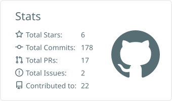
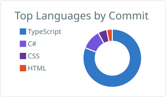
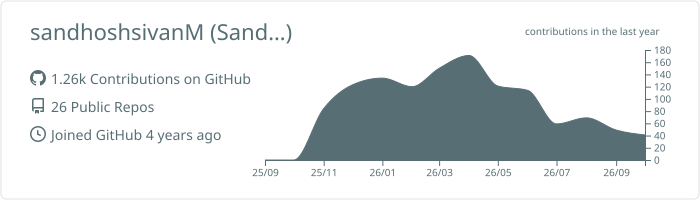

<!-- Animated header banner -->

<!-- Animated typing subtitle -->

  

  
  

---

### 👋 About Me

I build backend systems for enterprise ERP — and full stack products on my own time.

- 💼 **.NET Backend Developer @ Technoduces** (Mar 2023 – present), delivering on-site for **Adeeb Group, Abu Dhabi**
- 🏗️ Sole backend developer on a **28-module ERP platform** — 600+ REST endpoints, 1,170+ domain entities, 500+ concurrent users
- 💰 Deepest in **finance systems**: a double-entry General Ledger with 16 transaction handlers that passed internal audit
- ⚡ Things I enjoy building: caching layers, event-driven pipelines, and search that doesn't need a cloud API
- ✍️ I write about **.NET and finance engineering** on [Medium](https://medium.com/@sandhoshsivan00)
- 📫 **sandhoshsivan00@gmail.com**

---

### 🛠️ Tech Stack

**Backend**

**Frontend**

**Data & Infrastructure**

---

### 🚀 Featured Projects

| Project | What it is | Stack |
| --- | --- | --- |
| **[HireFlow Pro v2](https://github.com/sandhoshsivanM/hireflow-pro-v2)** | Job-application tracking SaaS with AI resume/JD match scoring. Deployed, with Stripe billing. | .NET 10 · React 19 · PostgreSQL · Claude + Gemini |
| **[Khazana](https://github.com/sandhoshsivanM/FinTech)** | Offline-first personal finance app. All data AES-256 encrypted on device — no backend, no cloud DB. | Flutter · Next.js · SQLCipher · Tauri 2 |
| **[Airline Fuel MS](https://github.com/sandhoshsivanM/airline-fuel-ms-api)** · [Web](https://github.com/sandhoshsivanM/airline-fuel-ms-web) | Full stack fuel management system — JWT auth, EF Core, Angular SPA. | ASP.NET Core 10 · Angular |
| **[Steel Strike](https://github.com/sandhoshsivanM/steel-strike)** | Metal Slug–inspired 2D run-and-gun platformer. | .NET · MonoGame |

#### 🔐 Spotlight — Khazana

  <a href="https://khazana-app.netlify.app"><b>Try it in your browser →</b></a> &nbsp;·&nbsp;
  <a href="https://github.com/sandhoshsivanM/FinTech">Source &amp; screenshots</a> &nbsp;·&nbsp;
  <a href="https://github.com/sandhoshsivanM/FinTech/blob/feature/safety-net-and-hardening/docs/Khazana_Technical_Case_Study.pdf">Case study</a>

---

### 📊 GitHub Stats

  

<!-- Stats and languages: generated daily into this repo by .github/workflows/profile-cards.yml -->

  <picture>
    <source media="(prefers-color-scheme: dark)" srcset="./profile-summary-card-output/tokyonight/3-stats.svg" />
    
  </picture>
  <picture>
    <source media="(prefers-color-scheme: dark)" srcset="./profile-summary-card-output/tokyonight/2-most-commit-language.svg" />
    
  </picture>

---

### 🐍 Watch the snake eat my contributions

  <picture>
    <source media="(prefers-color-scheme: dark)" srcset="https://raw.githubusercontent.com/sandhoshsivanM/sandhoshsivanM/output/github-contribution-grid-snake-dark.svg" />
    <source media="(prefers-color-scheme: light)" srcset="https://raw.githubusercontent.com/sandhoshsivanM/sandhoshsivanM/output/github-contribution-grid-snake.svg" />
    
  </picture>

---

### 📈 Contribution Activity

<!-- Generated daily into this repo by .github/workflows/profile-cards.yml -->

  <picture>
    <source media="(prefers-color-scheme: dark)" srcset="./profile-summary-card-output/tokyonight/0-profile-details.svg" />
    
  </picture>

---

### 🌐 Connect With Me

  
  
  
  

